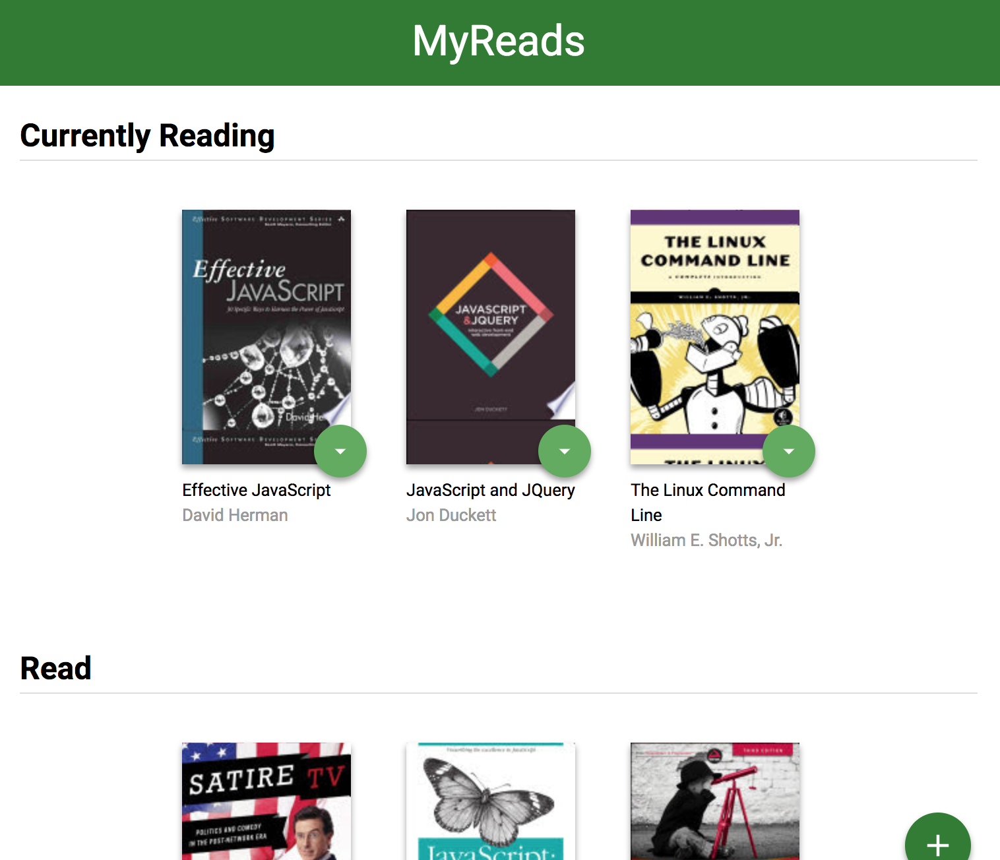
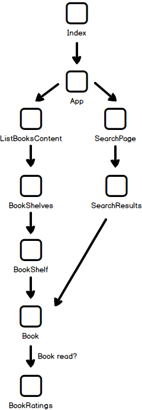

# MyReads Project

Book-sorting app created to learn application of React and React Router. Base was an html / css template, then using React functionality was added for:
- **Moving Books** - Books can stored on **Currently Reading, Read** or **Want to Read** shelves. You can switch shelves using the green arrow next to each book
    * Select **none** to remove book
- **Search** - Can search for new books using the `+` located on the bottom right of the home screen
    * You can add new books to shelves from the serach screen
- **Routing** - Can use the url "/search" to go to search screen, or "/" for home screen

## Getting Started

1. **Clone from GitHub** - Clone the app using `git clone https://github.com/learnathoner/reactnd-project-myreads-starter.git`
2. **Navigate to folder in terminal**
3. **Install dependencies** - In terminal: `npm install`
4. **Launch app**
    * **Development** - In terminal: `npm start`
    * **Production Build**
        1. **Install Serve** - `npm install -g serve`
        2. **Serve Folder** - `serve -s build`

## Component Flowchart

Above is the current layout of Components in the app. 

* `Index` wraps `App` in `Router`, then loads App
* `App` directs to either the `BookShelves` or `SearchPage` Components, and loads the search button
    * `SearchPage` loads `SearchResults`
        * If results are found, books are loaded from `Book`
    * `BookShelves` loads shelves from `BookShelf`
        * `BookShelf` creates a shelf using `Book`

